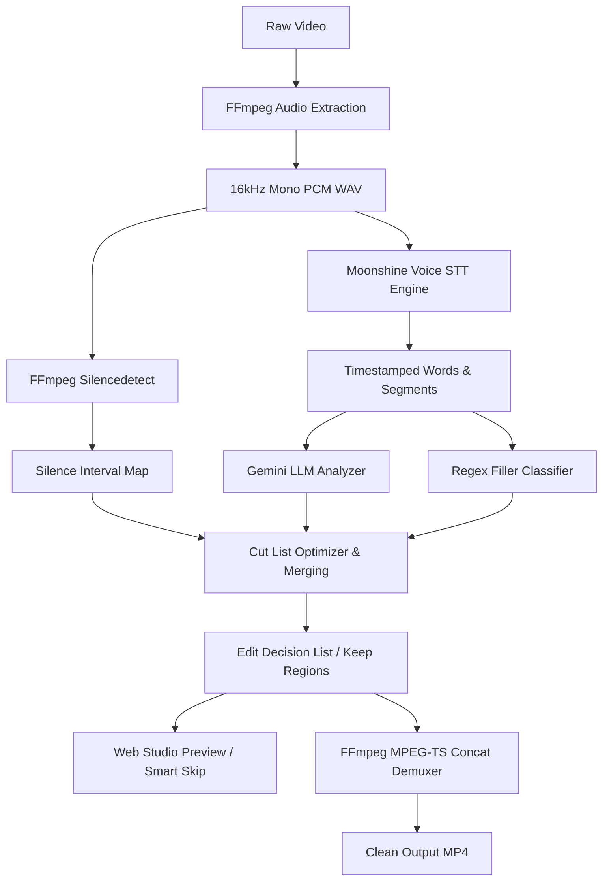

# CutFlow Architecture & System Design

This document details the internal architecture, algorithms, and data structures powering CutFlow.

---

## 1. System Pipeline Overview



---

## 2. Core Modules

### 2.1 `transcriber.py`
- **Audio Extraction:** Runs `ffmpeg -i <video> -ar 16000 -ac 1 -c:a pcm_s16le <audio.wav>`.
- **Speech-to-Text:** Invokes `moonshine-voice` to output timestamped segments and individual word timings.
- **Silence Detection:** Analyzes audio with `-af silencedetect=n=-35dB:d=0.8` to extract `silence_start` and `silence_end` events.

### 2.2 `analyzer.py`
- **False Starts & Retakes:** Passes the timestamped transcript to Gemini (`gemini-2.0-flash`) with structured prompts instructing it to detect consecutive semantically redundant sentences and select the most complete, polished take.
- **Filler Word Detection:** Identifies segments composed entirely of filler words (`um`, `uh`, `like, you know`) without breaking legitimate sentences.
- **Silence Padding:** Clips long pauses while leaving a 300ms buffer (`keep_gap`) around speech boundaries for natural pacing.
- **Overlapping Range Resolution:** Merges contiguous or overlapping cut intervals using a 100ms merge window.
- **Keep Region Inversion:** Computes the mathematical inverse of the cut ranges to generate exact `KeepRegion` segments.

### 2.3 `cutter.py`
- **MPEG-TS Concat Demuxer:** Slices each `KeepRegion` as an intermediate `.ts` chunk using `libx264` + `aac` and stitches them seamlessly via `ffmpeg -i concat:<inputs> -movflags +faststart`.

### 2.4 `server.py` & `static/index.html`
- **FastAPI REST Service:** Handles async video uploads, job polling, cut list updates, and streaming.
- **Web Studio SPA:** 
  - Dual synchronized timeline + transcript inspection.
  - **Smart Auto-Skip Algorithm:** Video player `timeupdate` hook checks if `currentTime` falls into any active cut range; if so, seeks instantly to the start of the next keep region. This enables real-time previewing of the edited video before rendering.

---

## 3. Data Schema

### 3.1 Transcript Schema
```json
{
  "duration": 45.2,
  "segments": [
    {
      "text": "Hello world, today we are...",
      "start": 0.0,
      "end": 2.4,
      "words": [{"text": "Hello", "start": 0.0, "end": 0.5}]
    }
  ],
  "silences": [
    {"start": 12.0, "end": 14.5, "duration": 2.5}
  ]
}
```

### 3.2 Analysis Schema
```json
{
  "total_duration": 45.2,
  "kept_duration": 32.1,
  "cut_duration": 13.1,
  "cuts": [
    {
      "start": 5.2,
      "end": 8.0,
      "reason": "false_start",
      "explanation": "Speaker stopped mid-sentence and restarted in segment 3",
      "confidence": 0.92
    }
  ],
  "keeps": [
    {
      "start": 0.0,
      "end": 5.2,
      "text": "Hello world..."
    }
  ]
}
```
